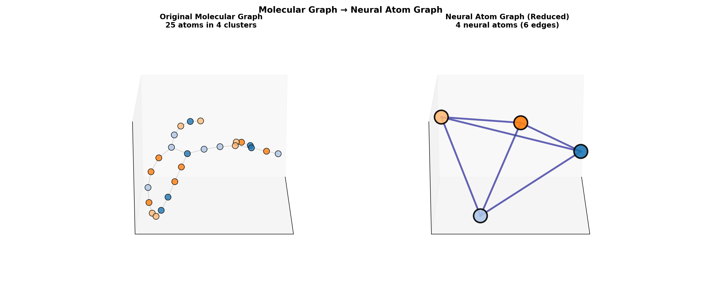

# Neural Atom

This modification of the original implementation which uses spectral clustering in reciprocal (Fourier) space for adaptive neural atom pooling.

<p align="center">
  
</p>

## What is this?

This extends the [Neural Atom](https://arxiv.org/abs/2311.01276) method by using **Fourier-based clustering** instead of fixed or learned cluster counts. The key idea: transform atom embeddings to frequency domain, cluster based on spectral similarity, then transform back.

**Why?** Different molecular structures have different frequency signatures - rings, chains, functional groups appear as distinct patterns in Fourier space.

## Method

Below is a **paste‑ready, equations‑only** block for your README. It turns Neural Atoms into an **adaptive** module where the *effective* number of neural atoms is **learned** (via simple sigmoid gates + (L_1) sparsity). It’s a drop‑in replacement for the project→exchange→retrieve steps in the original NA paper.  

---

### Adaptive Neural Atoms — minimal equations

**Inputs & shapes.**
(H\in\mathbb{R}^{N\times d}) (atom embeddings), (K_{\max}) (upper bound on neural atoms), (P\in\mathbb{R}^{K_{\max}\times p}) (prototypes), (W_{\text{out}}\in\mathbb{R}^{p\times d}).
*(Optional reciprocal view; keep if you have 3D coords (,R\in\mathbb{R}^{N\times 3},))*
Choose fixed low‑freq wavevectors (G\in\mathbb{R}^{M\times 3});
(U=RG^\top\in\mathbb{R}^{N\times M},\quad \Phi=[\cos U;|;\sin U]\in\mathbb{R}^{N\times 2M}).
Concatenate features: (X=[,H;|;\Phi,]\in\mathbb{R}^{N\times p}) (take (p=d+2M)).
*(If no coords, just set (X=H).)*

**Project (atoms → neural atoms, soft grouping).**
[
S=\frac{X P^\top}{\sqrt{p}}\in\mathbb{R}^{N\times K_{\max}},\qquad
A=\operatorname{softmax}*{\text{row}}(S)\in\mathbb{R}^{N\times K*{\max}}.
]

**Learned gates (make the count adaptive).**
[
g=\sigma(\theta)\in(0,1)^{K_{\max}},\qquad
\widetilde A = A,\operatorname{Diag}(g)\in\mathbb{R}^{N\times K_{\max}}.
]

**Exchange (neural‑atom self‑attention).**
[
Y=\widetilde A^\top X\in\mathbb{R}^{K_{\max}\times p},\qquad
Y'=\operatorname{MHA}(Y)\in\mathbb{R}^{K_{\max}\times p}.
]

**Retrieve (neural atoms → atoms, residual update).**
[
\Delta H=\widetilde A,Y',W_{\text{out}}\in\mathbb{R}^{N\times d},\qquad
H_{\text{out}}=H+\Delta H\in\mathbb{R}^{N\times d}.
]

**Training objective (learn the number).**
[
\mathcal{L}=\mathcal{L}*{\text{task}}+\lambda\sum*{k=1}^{K_{\max}} g_k
\quad\text{(small }\lambda\text{; prune at inference if }g_k<\varepsilon\text{).}
]

**Effective count (for logging / pruning).**
[
K_{\text{eff}}=\left|\left{k:;g_k>\varepsilon\right}\right|.
]

---

**Notes.**

* The **NA skeleton** (project→exchange→retrieve) is unchanged; only (K) becomes **data‑driven** via (g).  
* The optional reciprocal features ([\cos(RG^\top),\sin(RG^\top)]) mirror the **Ewald** split (long‑range structure emerges in reciprocal space). ([ScienceDirect][1])
* If you prefer **hard** on/off tokens, swap the (L_1) gate penalty for **(L_0) (hard‑concrete) gates** and keep the same wiring. ([arXiv][2])

*References:* Neural Atoms (ICLR’24), Sec. 3, Eqs. (1)–(3).  

[1]: https://www.sciencedirect.com/science/article/pii/0010465596000161?utm_source=chatgpt.com "Ewald summation techniques in perspective: a survey"
[2]: https://arxiv.org/abs/1712.01312?utm_source=chatgpt.com "Learning Sparse Neural Networks through $L_0$ Regularization"


## Results

Quick end-to-end evaluation on 1k real peptide molecules (10-class multi-label):
- 5 epochs of training with Fourier clustering inside the pooling step
- Test accuracy: **88.40%**
- Mean test AUC: **0.6883**
- Avg cluster count: **6.6 ± 0.7** (range 5–8)

Clustering-only benchmarking on 500 peptide molecules (sizes 13–100 atoms):
- Fourier proximity clustering (threshold 1.5) -> 3–10 clusters, ~6.8 atoms per cluster

<p align="center">
  
  
  
</p>

## Citation

**Original Neural Atom:**
```bibtex
@inproceedings{li2024neuralatoms,
  title={Neural Atoms: Propagating Long-range Interaction in Molecular Graphs
         through Efficient Communication Channel},
  author={Xuan Li and Zhanke Zhou and Jiangchao Yao and Yu Rong and
          Lu Zhang and Bo Han},
  booktitle={ICLR},
  year={2024}
}
```
